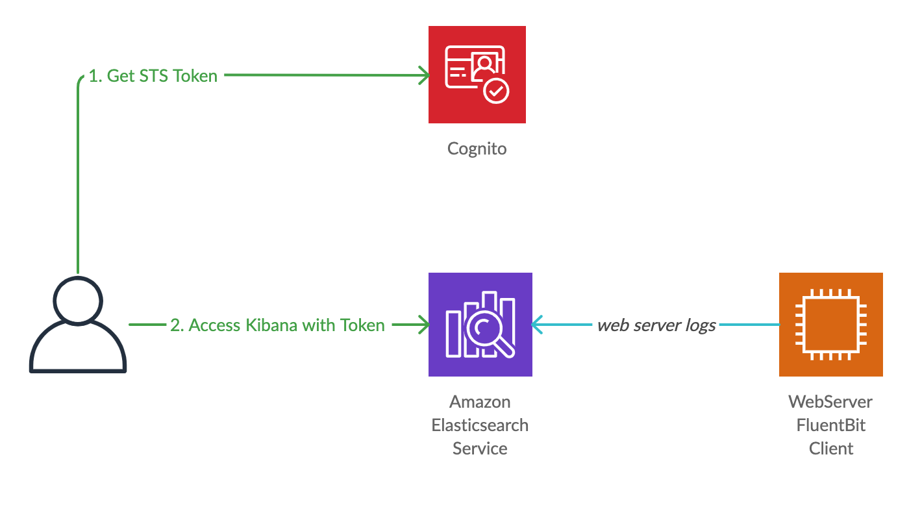
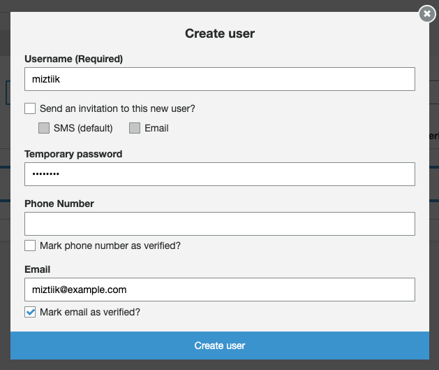
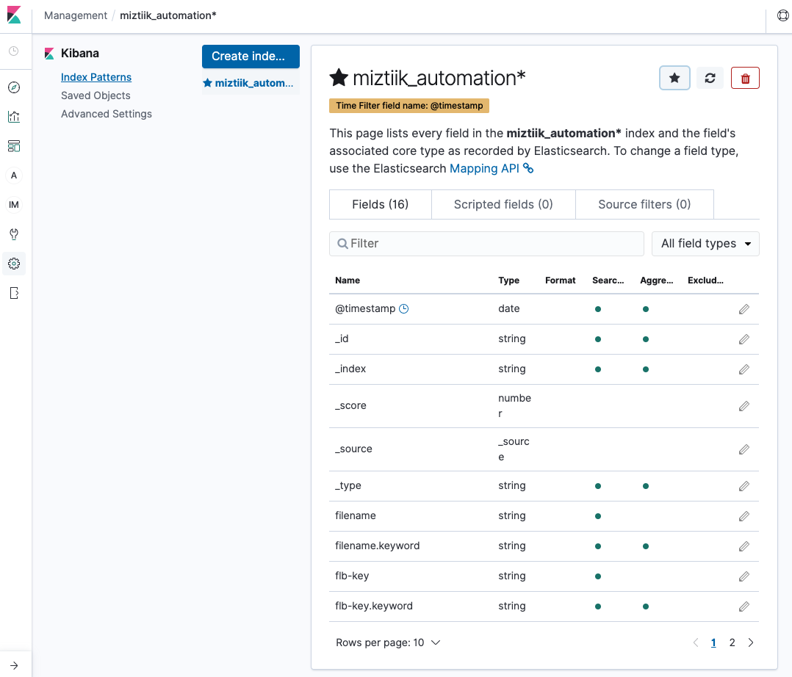
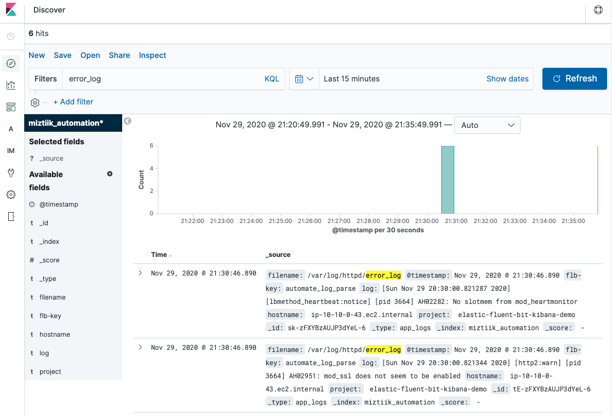

# EFK Stack: Elastic Fluent Bit and Kibana in AWS

Mystique Unicorn app is generating lot of logs. They are looking for a light weight log router that can send logs from their EC2 instances running the web and application components to an elasticsearch cluster. They have already tried few clients like _logstash_ & _fluentd_ but not satifisfied with the memory profile of these clients. They recenlty heard about _Fluent Bit_ having a better or _similar_ performance compared to Fluentd.

To help in the analysis of logs, they are using kibana until now from the same network without any authentication. During the recent security review, they have been asked to implement authentication mechanism for the kibana access.

Can you help them configure their web servers with fluent bit and push the logs to Amazon ElasticSearch Cluster and setup authentication for the kibana access?

## 🎯 Solutions

We will follow an multi-step process to accomplish our goal.

1. Web Server
   - Install web server(\_For example Apache `httpd`)
   - Bootstrap with Fluent Bit Agent
   - Configure the agent with the elasticsearch cluster endpoint.
1. ElasticSearch Cluster
   - Create & Configure the cluster to authenticate using cognito. You can find more details about how the cognito authenticaion works in the cognito stack deployment below.



In this article, we will build an architecture, similar to the one shown above. We will start backwards so that all the dependencies are satisfied.

1.  ## 🧰 Prerequisites

    This demo, instructions, scripts and cloudformation template is designed to be run in `us-east-1`. With few modifications you can try it out in other regions as well(_Not covered here_).

    - 🛠 AWS CLI Installed & Configured - [Get help here](https://youtu.be/TPyyfmQte0U)
    - 🛠 AWS CDK Installed & Configured - [Get help here](https://www.youtube.com/watch?v=MKwxpszw0Rc)
    - 🛠 Python Packages, _Change the below commands to suit your OS, the following is written for amzn linux 2_
      - Python3 - `yum install -y python3`
      - Python Pip - `yum install -y python-pip`
      - Virtualenv - `pip3 install virtualenv`

1.  ## ⚙️ Setting up the environment

    - Get the application code

      ```bash
      git clone https://github.com/miztiik/elastic-fluent-bit-kibana
      cd elastic-fluent-bit-kibana
      ```

1.  ## 🚀 Prepare the dev environment to run AWS CDK

    We will use `cdk` to make our deployments easier. Lets go ahead and install the necessary components.

    ```bash
    # You should have npm pre-installed
    # If you DONT have cdk installed
    npm install -g aws-cdk

    # Make sure you in root directory
    python3 -m venv .venv
    source .venv/bin/activate
    pip3 install -r requirements.txt
    ```

    The very first time you deploy an AWS CDK app into an environment _(account/region)_, you’ll need to install a `bootstrap stack`, Otherwise just go ahead and deploy using `cdk deploy`.

    ```bash
    cdk bootstrap
    cdk ls
    # Follow on screen prompts
    ```

    You should see an output of the available stacks,

    ```bash
    elastic-fluent-bit-kibana-cognito-for-stack
    elastic-fluent-bit-kibana-vpc-stack
    elastic-fluent-bit-kibana-es-stack
    elastic-fluent-bit-kibana-fluent-bit-on-ec2-stack
    ```

1.  ## 🚀 Deploying the application

    Let us walk through each of the stacks,

    - **Stack: elastic-fluent-bit-kibana-cognito-for-stack**

      Amazon Cognito<sup>[2]</sup> provides authentication, authorization, and user management for your web and mobile apps, in this case your Elasticsearch cluster. Your users can sign in directly with a user name and password, or through a third party such as Facebook, Amazon, Google or Apple. The two main components of Amazon Cognito are `user pools` and `identity pools`.

      - **User pools** are user directories that provide sign-up and sign-in options for your app users.
      - **Identity pools** enable you to grant your users access to other AWS services. In our case we will

      

      Our goal is to authenticate our user and provide temporary AWS credentials for the Elasticsearch cluster.

      1. In the first step your app user signs in through a user pool and receives user pool tokens after a successful authentication.
      1. Next, your app exchanges the user pool tokens for AWS credentials through an identity pool.
      1. Finally, your app user can then use those AWS credentials to access other AWS services such as Amazon S3 or DynamoDB.

      Our stack will create a number of resources,

      1. User Pool
         - Add a `cognito-domain` to the user pool
      1. Identity Pool
         - Configure it with the user pool created in the previous step
         - Disable _UnAuthenticated_ access.
      1. IAM Role - This role allows cognito service to get a temporary token on behalf of authenticated users.
         - Let us call this as `es_auth_role`
      1. IAM Role with `AmazonESCognitoAccess` permissions. Our authenticated users will assume this role to administer our ES clusters.
         - We will call this `es_role`

      

      Initiate the deployment with the following command,

      ```bash
      cdk deploy elastic-fluent-bit-kibana-cognito-for-stack
      ```

      Check the `Outputs` section of the stack. You can use `CreateCognitoUserConsole` to create your end users. I have disabled _SignUp_ in cognito as we will create the users using the Admin GUI. In a enterprise scenario, you will be using the SAML or OAuth based `Identity Pool`<sup>[3]</sup> as your identity provider.

    - **Stack: elastic-fluent-bit-kibana-vpc-stack**

      We need a VPC to host our web server. This stack will create a multi-az VPC. There are no NAT Gateway deployed hence & no private subnets with internet access. We will have an _isolated_ or _db_ subnets. If you want to have private subnets you can modify the CDK code for the same.

      Initiate the deployment with the following command,

      ```bash
      cdk deploy elastic-fluent-bit-kibana-vpc-stack
      ```

      Check the `Outputs` section of the stack and ensure the stack had been deployed properly.

    - **Stack: elastic-fluent-bit-kibana-es-stack**

      This stack will create an Amazon ElasticSearch Cluster with `no` dedicated master and `2` data nodes. Our ES cluster will also have a custom domain name.

      We use use the `user_pool`, `identity_pool` and `es_role` created in the cognito stack to enable secure authentication to our cluster. For access policy, use `es_auth_role` as the principal. This where the magic happens, where an authenticated user will be able to assume this principal get access to the ES cluster using the `es_role` permissions.

      Finally, The web server needs to know the ES Domain & AWS Region to send the logs. We will use AWS Systems Manager Parameter Store and retrive them in our web server stack.

      Initiate the deployment with the following command,

      ```bash
      cdk deploy elastic-fluent-bit-kibana-es-stack
      ```

      Check the `Outputs` section of the stack. You can find the ES Domain & Kibana Url to Login.

    - **Stack: elastic-fluent-bit-kibana-fluent-bit-on-ec2-stack**

      This stack will create an EC2 instance using Amazon Linux 2 machine image. We will also use the `user_data` field to bootstrap the server with `httpd` packages. We will use AWS Systems Manager Run Command to install Fluent Bit and configure it to send logs our ES Cluster.

      The default installation of `httpd` creates two `/var/log/httpd/access_log` and `/var/log/httpd/error_log`. We will push these two log files to our ES Cluster. To do that we will use `tail` input plugin<sup>[4]</sup> of Fluent Bit. To send them to elasticsearch we use the `es` outputs<sup>[5]</sup> plugin.

      Finally, We need to provide permissions to allow our fluent bit plugin to push logs to ES Cluster. We do this by adding an IAM role to our Web Server. This way, we do not have to hard code any credentials and fluent bit supports _`AWS_Auth`_ signed requests, We will do this in this _Outputs_ plugin configuration, by setting up the boolean value to `On`.

      Initiate the deployment with the following command,

      ```bash
      cdk deploy elastic-fluent-bit-kibana-fluent-bit-on-ec2-stack
      ```

      Check the `Outputs` section of the stack. You will find the public url of the web server. Optionally, you can login to the server and generate dummy traffic to the webserver using Apache WorkBench `ab`. These commands can also be found in the outputs section of the stack.

1.  ## 🔬 Testing the solution

    As our web app is shiny new, there will be hardly any traffic(_or logs_) to be pushed to ES. You can use the public dns name of the web server in your webserver few times _Or_ if you want to generate a lot of traffic, use your favorite load tool like `artillery` or `locust` or `apache workbench `ab` depending on your needs.

    Once you are done with generating the traffic, we ready to view them in our ES Cluster/Kibana. For this we need a user. The Cognito Stack outputs section has the url for Cognito Console UI.

    - `Create User`
    - **UnCheck** Send invitation
    - Fill `Username` _For example: `miztiik`_
    - Fill `Temporary Password`
    - **UnCheck** Phone Number
    - Fill `Email` _For example: `miztiik@example.com`_

    

    The ES stack outputs has your kibana login url, With this _username_ & _password_ you should be able to login to kibana. To create index patterns, complete the following steps:

    - Open the Kibana application using the URL from Amazon ES Domain Overview page.
    - On the navigation panel, choose the _gear icon_ to open the Management page.
    - Choose **Index Patterns**.
    - Choose **Create index pattern**.
    - For Index pattern, enter `miztiik_automation` with an asterisk wild card (`miztiik_automation*`) as your default index pattern.
    - For `Time filter`, choose `@timestamp`.
    - Choose **Create index pattern**. This index pattern is set as default automatically. If not, choose the _star_ icon.

    After successfully completing the above steps, you should be able to see something like this,

    

    **Explore the logs using discovery feature**

    You can explore your log data with Kibana’s data discovery functions. You now have access to every event from our web server. You can view data by submitting search queries and filter results using Lucene query syntax<sup>[8]</sup>. You can use the **Disover** pane on the left and search for `access_log` or `error_log`.

    

    You can create your dashboards<sup>[7]</sup> and alarms<sup>[6]</sup> as shown in these blogs.

1.  ## 📒 Conclusion

    Here we have demonstrated how to use Fluent Bit to send any logs to elasticsearch cluster. We also have shown how to use cognito to provide secure access to web developers users to the kibana dashboards.

1.  ## 🧹 CleanUp

    If you want to destroy all the resources created by the stack, Execute the below command to delete the stack, or _you can delete the stack from console as well_

    - Resources created during [Deploying The Application](#-deploying-the-application)
    - Delete CloudWatch Lambda LogGroups
    - _Any other custom resources, you have created for this demo_

    ```bash
    # Delete from cdk
    cdk destroy

    # Follow any on-screen prompts

    # Delete the CF Stack, If you used cloudformation to deploy the stack.
    aws cloudformation delete-stack \
      --stack-name "MiztiikAutomationStack" \
      --region "${AWS_REGION}"
    ```

    This is not an exhaustive list, please carry out other necessary steps as maybe applicable to your needs.

## 📌 Who is using this

This repository aims to show EFK stack best practices to new developers, Solution Architects & Ops Engineers in AWS. Based on that knowledge these Udemy [course #1][103], [course #2][102] helps you build complete architecture in AWS.

### 💡 Help/Suggestions or 🐛 Bugs

Thank you for your interest in contributing to our project. Whether it is a bug report, new feature, correction, or additional documentation or solutions, we greatly value feedback and contributions from our community. [Start here](/issues)

### 👋 Buy me a coffee

[](https://ko-fi.com/Q5Q41QDGK) Buy me a [coffee ☕][900].

### 📚 References

1. [What is Amazon Cognito][2]

1. [Amazon Cognito Identity Pools][1]

1. [Set alerts in Amazon Elasticsearch Service][6]

1. [Configuring and authoring Kibana dashboards][7]

1. [Apache Lucene - Query Parser Syntax][8]

### 🏷️ Metadata


**Level**: 300

[1]: https://docs.aws.amazon.com/cognito/latest/developerguide/authentication-flow.html
[2]: https://docs.aws.amazon.com/cognito/latest/developerguide/what-is-amazon-cognito.html
[3]: https://docs.aws.amazon.com/cognito/latest/developerguide/saml-identity-provider.html
[4]: https://docs.fluentbit.io/manual/pipeline/inputs/tail
[5]: https://docs.fluentbit.io/manual/pipeline/outputs/elasticsearch
[6]: https://aws.amazon.com/blogs/big-data/setting-alerts-in-amazon-elasticsearch-service
[7]: https://aws.amazon.com/blogs/database/configuring-and-authoring-kibana-dashboards
[8]: https://lucene.apache.org/core/2_9_4/queryparsersyntax.html
[100]: https://www.udemy.com/course/aws-cloud-security/?referralCode=B7F1B6C78B45ADAF77A9
[101]: https://www.udemy.com/course/aws-cloud-security-proactive-way/?referralCode=71DC542AD4481309A441
[102]: https://www.udemy.com/course/aws-cloud-development-kit-from-beginner-to-professional/?referralCode=E15D7FB64E417C547579
[103]: https://www.udemy.com/course/aws-cloudformation-basics?referralCode=93AD3B1530BC871093D6
[899]: https://www.udemy.com/user/n-kumar/
[900]: https://ko-fi.com/miztiik
[901]: https://ko-fi.com/Q5Q41QDGK
